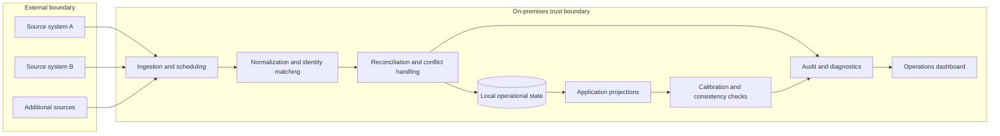

# Architecture

## System Context

The private application is an on-premises integration platform. The public diagram deliberately describes responsibilities and trust boundaries without exposing product names, endpoints, schemas, or infrastructure details.



The ingestion layer overlaps with conventional ETL or ADF capabilities. The differentiating behavior begins after transport: identity resolution, domain mapping, conflict policy, idempotency, partial-result handling, projections, calibration, and operational safety invariants remain application responsibilities.

## Public Package Architecture

This repository is an evidence package, not an application distribution.

```text
Intent and acceptance
        ↓
Specification ──→ Traceability ──→ Verification record
        │                │                  │
        ├──→ Decisions   ├──→ Risk controls ├──→ Evidence manifest
        │                │                  │
        └──────────── Quality gates ────────┘
                              ↓
                    Pull request + video
```

## Components

- Root documents explain purpose, contribution rules, status, and submission.
- `docs/` holds requirements, decisions, risks, traceability, verification, and handoff.
- `evidence/mockup/` is the single source for synthetic screenshots.
- `evidence/manifest.sha256` detects accidental evidence replacement.
- `.agents/skills/verify-capstone/` provides the agent review procedure.
- `factory/` defines the lights-on lifecycle, role boundaries, run state, corrections, and private-repository control templates.
- `scripts/` contains deterministic local gates.
- `.githooks/` prevents an unchecked commit after local installation.
- The repository-root `.github/workflows/denys-capstone.yml` checks only this submission, with its working directory explicitly set. CI is structural verification, not human release approval.
- `business-diagnostics.mjs` is shared by UI and evals; the browser policy is a checked projection of YAML. Output is schema-validated before rendering.

## Invariants

- Public artifacts must not depend on access to the private implementation.
- Historical evidence must remain labeled as historical.
- Synthetic evidence must never be described as a production screenshot.
- The strict gate must fail while submission placeholders remain.
- Human media review cannot be replaced by automation.
